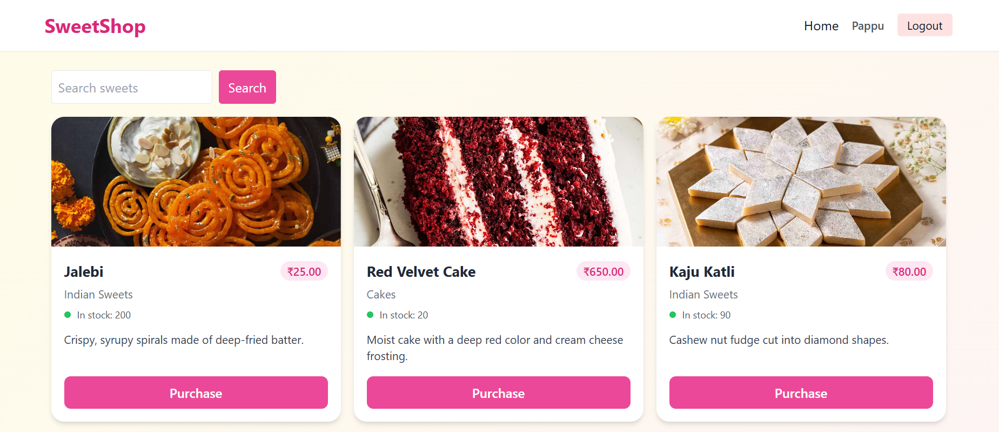
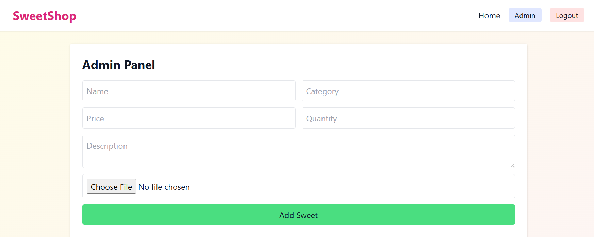
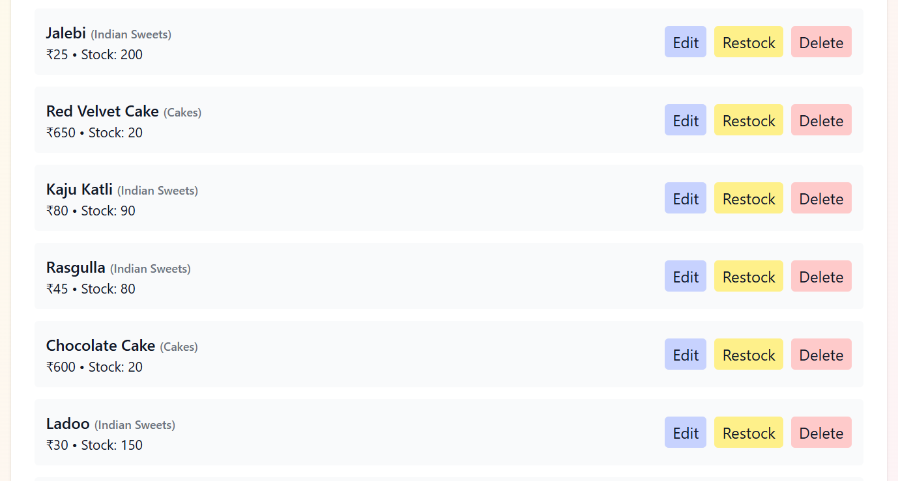
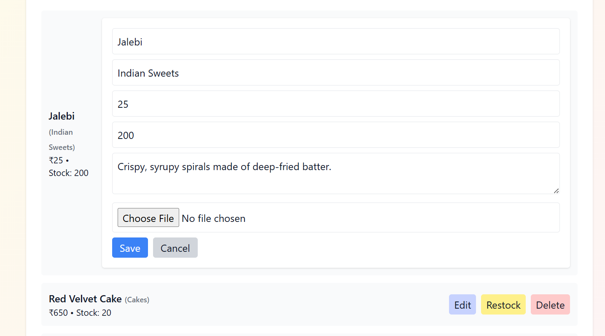

# 🍬 Sweet Shop Management System

The **Sweet Shop Management System** is a full-stack web application built to manage sweets inventory, purchases, and administration in a modern sweet shop.
This project was developed following **Test-Driven Development (TDD)** principles, clean coding practices, and leveraging AI tools responsibly during the workflow.


## 🚀 Features

### 🔹 Backend (API)

* **User Authentication** (JWT-based)

  * Register and log in
  * Role-based access (Admin vs. Customer)
* **Sweet Management**

  * Add, update, and delete sweets (Admin only)
  * View all available sweets
  * Search sweets by name, category, or price range
* **Inventory Management**

  * Purchase sweets (quantity decreases automatically)
  * Restock sweets (Admin only)

### 🔹 Frontend (SPA)

* **User Registration & Login Forms**
* **Dashboard** showing all available sweets
* **Search & Filter functionality**
* **Purchase button** (disabled when out of stock)
* **Admin Panel** for sweet CRUD operations
* **Responsive, modern UI** for a smooth shopping experience

---

## 🛠️ Tech Stack

### Backend

* **Language/Framework:** Node.js + Express (or NestJS) / Python + FastAPI / Java + Spring Boot / Ruby on Rails
* **Database:** PostgreSQL / MongoDB / SQLite
* **Authentication:** JWT

### Frontend

* **Framework:** React / Vue / Angular / Svelte
* **Styling:** TailwindCSS / Bootstrap / Custom CSS

### Development Practices

* **TDD Workflow** – Red → Green → Refactor
* **Clean Code Principles** – SOLID, modular structure, meaningful naming
* **Version Control** – Git with descriptive commits

---

## ⚙️ Installation & Setup

### 1. Clone Repository

```bash
git clone https://github.com/pappubishwas/SweetShop.git
cd Sweetshop
```

### 2. Backend Setup

```bash
cd backend
npm install
npm run dev
```

### 3. Frontend Setup

```bash
cd frontend
npm install
npm run dev
```

### 4. Database Setup

* Configure `.env` with your database credentials.


## 📸 Screenshots






---

## 🌐 Deployment

A live demo is available here:
👉 [Deployed App Link](https://sweet-shop-lilac.vercel.app/)

---

## 🤖 My AI Usage

This project intentionally incorporated **AI assistance** as part of the development workflow.

* **Tools Used:** ChatGPT, GitHub Copilot, Gemini
* **How I Used Them:**

  * Brainstormed API endpoint structures and authentication strategies
  * Generated initial boilerplate code for controllers and services
  * Asked for suggestions on test cases and edge scenarios
  * Debugging help for common errors and best practices
* **Reflection:**
  AI significantly improved development speed by reducing time spent on boilerplate and repetitive tasks. It also helped me explore different design approaches quickly. However, I ensured that all AI-generated code was **reviewed, customized, and tested** thoroughly before committing.

**AI Co-authorship:** For every commit where AI assistance was used, I added the AI tool as a co-author in the commit message, following the project’s guidelines.


✨ *Built with love, code, and a little help from AI.*

---
